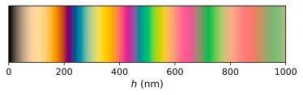

# The colour of soap films

This project shows how the colours exhibited by an illuminated soap film can be found by applying an interference relation derived for monochromatic waves at discrete wavelengths in the source. [Coherence effects on the colour of soap films]() provides a discussion of this method and its expected range of validity. All variables and equations implemented in `src/interference.py` are detailed in [coherence effects on the colour of soap films]().

Any of the example codes in `src` may be run with the following conda environment:
```
conda create -n soap-film numpy matplotlib
conda activate soap-film
pip install colour-science
```

## Examples

### Blackbody radiator
[`src/example_blackbody.py`](src/example_blackbody.py) shows how the colours of a soap film may be calculated when the light source is a blackbody radiator of specified temperature. This calculation considers an infinite number of interfering waves (see [paper]()). A fully vectorised implementation is provided in addition to a non-vectorised implementation. The non-vectorised method is more explicit, whilst the vectorised approach is **significantly** faster. The scaled spectral distribution of the source and the resulting thickness-colour relationships are shown for blackbodies of temperatures 3500 K, 6500 K and 9500 K:

| Source | Colour-thickness |
| :---: | :---: |
| 3500 K | 3500 K |
|  |  |
| 6500 K | 6500 K |
|  |  |
| 9500 K | 9500 K |
|  |  |

### Daylight 
[`src/example_daylight.py`](src/example_daylight.py) presents how the colours of a soap film illuminated by daylight may be calculated. This was done by using the D65 illuminant to represent daylight. This time, the coloured fringes are more widely spaced apart as a larger value was used for `theta_air`:

| Source | Colour-thickness |
| :---: | :---: |
|  |  |


## License

This code is distributed under the [MIT License](LICENSE).
