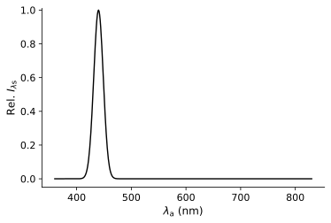
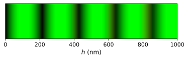

<div align="center">


[](https://zenodo.org/badge/latestdoi/600866116)


</div>

# The colour of soap films

This project shows how the colours exhibited by an illuminated soap film can be found by applying an interference relation derived for monochromatic waves at discrete wavelengths in the source. [Coherence effects on the colour of soap films]() provides a discussion of this method and its expected range of validity. All variables and equations implemented in [`src/interference.py`](src/interference.py) are detailed in [Coherence effects on the colour of soap films]().

The examples in [`src`](src) may be run using `python` with a conda environment created from [`conda-env.yml`](conda-env.yml):
```
conda env create -f conda-env.yml
```

All [`tests`](tests) can be checked by running `pytest` from the command line.

## Examples

### Blackbody radiator
[`src/example_blackbody.py`](src/example_blackbody.py) shows how the interference colours may be calculated when the light source is a blackbody radiator of specified temperature. This calculation considers an infinite number of interfering waves. A fully vectorised implementation is provided in addition to a non-vectorised implementation. The non-vectorised method is more explicit, whilst the vectorised approach is **significantly** faster. The scaled spectral distribution of the light source and the resulting interference colours are shown for blackbodies of temperatures 3500 K, 6500 K and 9500 K:

| Source | Colour-thickness |
| :---: | :---: |
| 3500 K | 3500 K |
|  |  |
| 6500 K | 6500 K |
|  |  |
| 9500 K | 9500 K |
|  |  |

### Daylight 
[`src/example_daylight.py`](src/example_daylight.py) presents how the interference colours may be calculated for a soap film illuminated by daylight. This was done by using the D65 illuminant to represent daylight. This time, the coloured fringes are more widely spaced apart as a larger value was used for `theta_air`:

| Source | Colour-thickness |
| :---: | :---: |
|  |  |

### Gaussian source 
[`src/example_gaussian_source.py`](src/example_gaussian_source.py) highlights how the colours of a soap film may be calculated when `source_sd` is specified by defining the numpy array through a calculation. Here, the spectral distribution of the light source follows a Gaussian distribution. It was assumed that the light source emits light polarised perpependicular to the plane of incidence, and $N = 5$ was used in the interference calculations.

| Source | Colour-thickness |
| :---: | :---: |
| $\overline{\lambda} = 440$ nm | $\overline{\lambda} = 440$ nm |
|  |  |
| $\overline{\lambda} = 550$ nm | $\overline{\lambda} = 550$ nm |
|  |  |
| $\overline{\lambda} = 660$ nm | $\overline{\lambda} = 660$ nm |
|  |  |

For a light source with spectral distribution composed of the sum of two Gaussian distributions:

| Source | Colour-thickness |
| :---: | :---: |
| $\overline{\lambda} \in \lbrace 440, 550 \rbrace$ nm | $\overline{\lambda} \in \lbrace 440, 550 \rbrace$ nm |
|  |  |

## Journal articles
An adapted version of this code was used in [The stability of magnetic soap films](https://doi.org/10.1063/5.0146164).

## License

This code is distributed under the [MIT License](LICENSE).
